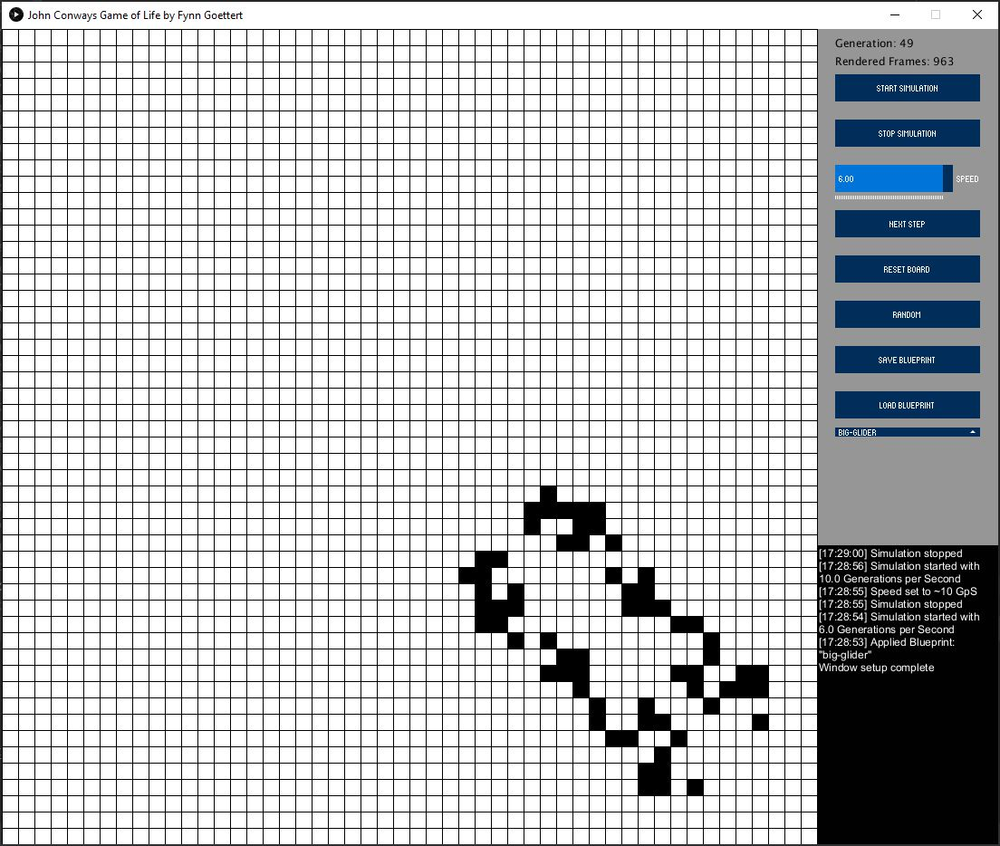

# John Conways Game of Life PiS, SoSe 2021
Autor: Fynn Göttert

This was for my Project in Programming of Interactive Systems in the Summer-Semester of 2021 at THM
Built with Gradle 7.0-rc-2 & openjdk 16 2021-03-16
To start `gradle run` to run tests `gradle test`

##Kurzbeschreibung
John Conways Game of Life ist ein Zellulärer Automat. Das heißt, der Status jeder Zelle (tot oder lebendig)
hängt von der letzten Generation und der Anzahl der benachbarten Zellen ab. Die Vier Regeln für John Conways Game of Life sind:
- Jede lebendige Zelle mit weniger als zwei Nachbarn stirbt
- Jede lebendige Zelle mit mehr als vier Nachbarn stirbt
- Jede lebendige Zelle mit genau 2 oder 3 Nachbarn überlebt
- Jede tote Zelle mit genau 3 Nachbarn wird wiederbelebt

In meiner Implementierung hat man außerdem die Möglichkeit "Blaupausen" zu laden und speichern.
(90)

## Screenshot

## Bedienungshinweise
Das Programm wird mit `gradle run` gestartet und die Tests laufen mit `gradle test`.

Ansonsten ist es eigentlich relativ selbsterklärend. Man ändert den Status einer Zelle mit einem Klick auf die jeweilige Zelle.
Mit `Start Simulation` und `Stop Simulation` wird die Simulation gestartet bzw. gestoppt. Mit dem Regler unter diesem Button wird die Geschwindigkeit jeder einzelnen Generation variiert (min: 1 Gen / Sek, max: 60 Gen / Sek). Mit `Next Step` kann man einzelne Generationen berechnen und mit `Reset board` werden alle Zellen auf der Fläche zurückgesetzt.
Mit `Save Blueprint` werden alle Lebenden Zellen in einer neuen Blaupause gespeichert.
In dem Dropdown kann man eine Vordefinierte bzw. Benutzererstellte Blaupause auswählen und diese mit `Load Blueprint` laden.
Mit `Random` werden zufällige Zellen auf dem Spielfeld umgekehrt.
In der unteren Rechten Ecke befindet sich außerdem ein Log indem Ereignisse bzw. Warnungen stehen.

## Dateiübersicht und Lines of Code

~~~
\README.md
\screenshot.JPG
\settings.gradle
\app\build.gradle
\app\control.jar
\app\core.jar
\app\src\main\java\GameOfLife\Blueprint.java
\app\src\main\java\GameOfLife\Cell.java
\app\src\main\java\GameOfLife\Core.java
\app\src\main\java\GameOfLife\GameLogic.java
\app\src\main\java\GameOfLife\GameWindow.java
\app\src\resources\blueprints.json
\app\src\test\java\GameOfLife\CellTest.java
\app\src\test\java\GameOfLife\CoreTest.java
~~~
Übersicht alle Dateien
~~~
-------------------------------------------------------------------------------
Language                     files          blank        comment           code
-------------------------------------------------------------------------------
Java                             7            117             51            561
Bourne Shell                     1             23             36            126
DOS Batch                        1             21              2             66
JSON                             2              0              0             64
Markdown                         1             13              0             45
Gradle                           2             10             22             21
-------------------------------------------------------------------------------
SUM:                            14            184            111            883
-------------------------------------------------------------------------------
~~~
Übersicht Relevante LOC
~~~
-------------------------------------------------------------------------------
File                             blank        comment           code
-------------------------------------------------------------------------------
./GameWindow.java                   19              0            154
./Core.java                         19              5            146
./Cell.java                         12              0             37
./GameLogic.java                     2              0             16
./Blueprint.java                     3              0             15
-------------------------------------------------------------------------------
SUM:                                55              5            368
-------------------------------------------------------------------------------
~~~

### Quellen

- https://processing.org/reference/
- http://www.sojamo.de/libraries/controlP5/reference/index.html
- https://playgameoflife.com/lexicon (Blueprints)
- https://attacomsian.com/blog/gson-read-json-file (Gson)